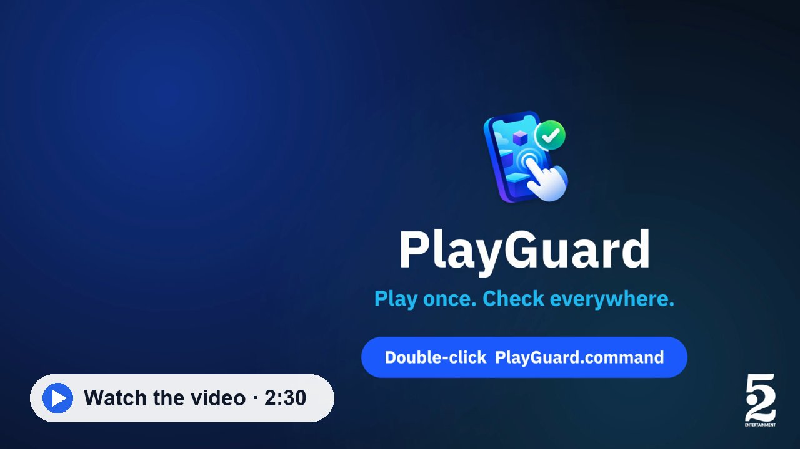
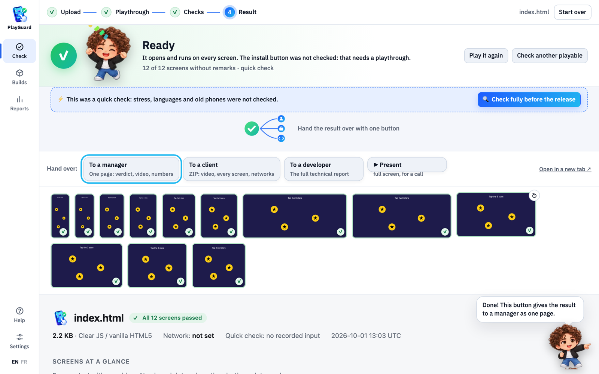
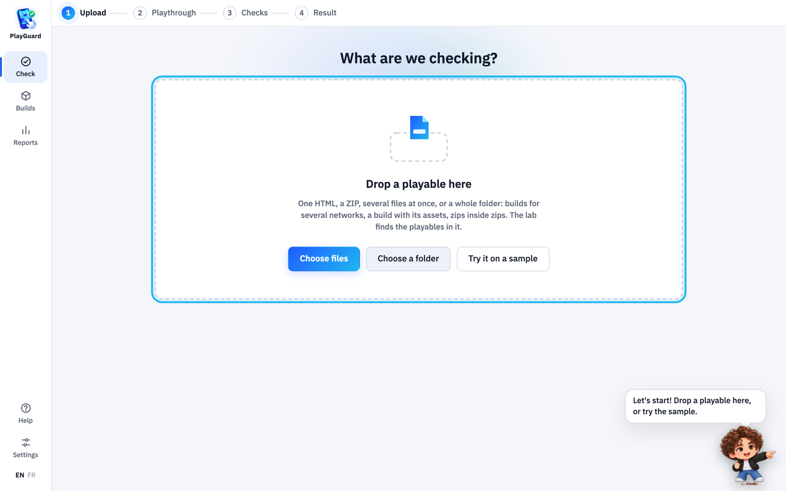
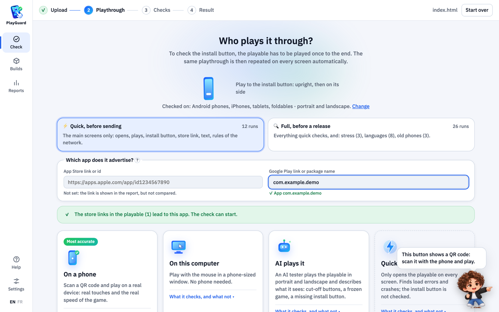
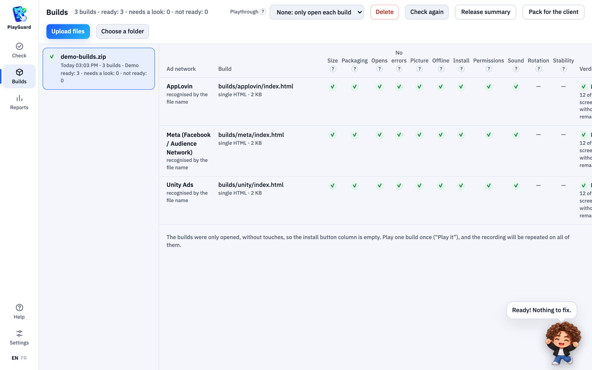

# PlayGuard

**PlayGuard checks playables — the interactive mini-games inside ads — before they go to an ad network.**

Someone plays the playable once: on a phone, with the mouse, or an AI does it. PlayGuard replays that playthrough on screens of every shape and watches for errors, sound, the install button and each ad network's rules. In the end it gives one clear verdict: **Ready**, **Needs a look** or **Not ready**.

[](video/PlayGuard_v7.mp4)



> How to start and use it, in short: [КАК-НАЧАТЬ.md](КАК-НАЧАТЬ.md) (Russian).
> Technical description for developers: [docs/TECHNICAL.md](docs/TECHNICAL.md).

---

## Why it exists

A playable that works fine on the developer's phone can still:

- get cut off on a tall Android phone or a squarish tablet;
- break when the screen is rotated;
- fail to open the store from the Install button, or open the wrong app;
- go over the file size limit of the network;
- reach out to the internet, which many networks forbid;
- play sound before the first touch;
- work in Chrome but crash in Safari on an iPhone.

A network rejects such a playable, and if it lets it through, the ad performs badly and loses money. These things used to be checked by hand on a few phones. PlayGuard checks every screen shape at once, the same way every time, and writes the result so that anyone can read it, not only a developer.

## What it does, step by step

A check is a wizard with four steps.

### 1. Upload

Drop into the window:

- one playable HTML file;
- a ZIP with builds for several networks;
- several files or a whole folder.

PlayGuard recognises the engine (Luna Playworks, Cocos Creator, plain HTML5 / JavaScript) and tells from the file name or the code which ad network a build is for. "Checked before" lists every playable with its latest verdict.



### 2. Playthrough

Someone has to play the playable once, up to the install button. The options:

| How | What it looks like |
| --- | --- |
| **On a phone** | A QR code appears. Point the phone camera at it and the playable opens full-screen. The phone must be on the same Wi-Fi. |
| **With the mouse** | The playable opens in a phone-sized window on this computer. |
| **AI** | An AI plays it, looks at the screen and notices what is broken. |
| **Quick check** | No playthrough: only checks that the playable loads and breaks no rules. |

While you play on the phone, the computer shows copies of the playable on screens of other sizes, and every touch is repeated on all of them at once. You see how the same playthrough looks on an iPhone SE and on an iPad.

The playthrough is done twice: portrait, then landscape. If the phone is rotated in the middle of a recording, PlayGuard stops it and asks to replay that step: mixing orientations would make the result unreliable.

This is also where you enter your app's App Store and Google Play links, so PlayGuard can check that the install button leads exactly there.



### 3. Checks

PlayGuard replays the recorded playthrough on every screen, with no phone and no person. A touch lands "on the same object", not just on the same spot: if the button sits lower on a narrow screen, PlayGuard takes that into account (for engines where that is possible).

While it runs you see how many screens are done and about how long is left. You can do something else meanwhile.

### 4. Result

On top, one verdict: **Ready**, **Needs a look** or **Not ready**. Under it, plain answers to simple questions:

- Does the install button open the store?
- Does it work without the internet?
- Does everything fit on the screen?
- Is it silent until the player touches it?

The answers are grouped into needs fixing, worth checking, not tested and fine, each with the screens it is about.

## What is checked

### On every screen

- **It loads** at all.
- **No code errors** that break the game.
- **The screen is not blank**: sometimes everything "loads" and the screen is one flat colour.
- **It reacts to touches.**
- **The install button** works, opens the store of that platform (App Store on iPhone, Google Play on Android) and the right app, and does not fire by itself without a touch.
- **No internet requests**, where the network forbids them.
- **Sound**: silent until the first touch, and silent while the ad is hidden.
- **Restricted browser features**: asking for location, camera or notifications and pop-up dialogs fail the check; vibration, the clipboard and writing data to the browser are warnings, since only some networks forbid them.
- **Frame rate**: whether the game stutters (green zone 50+ frames per second, yellow 30–50, red under 30).
- **Text**: whether it runs off the screen, is cut off or is too small.
- **Translations**: the playable is opened with different phone languages and compared with the English version: what is not translated and what no longer fits.

### Stress scenarios

- **Idle**: the playable is left untouched for 30 seconds (2 or 5 minutes in Settings). It must not crash, go blank or open the store by itself; memory growth is measured as well.
- **Monkey**: 40 random taps and swipes, to see whether chaotic input breaks the game.
- **Rotate**: the screen is turned on its side and back; the picture must still fit.

### The file itself

- **Size** against the limit of that network, and how many seconds it takes to download on slow 3G and on 4G.
- **What the file is made of**: shares of images, sound and code, with the heaviest items listed — the first thing to read when a network rejects the size.
- **No stray external files**, and no links to another app.
- **Calls and tags the network requires** in the code.

### Screens

By default PlayGuard takes one screen of each shape — 21:9 and 20:9 tall phones, a regular 16:9 phone, 16:10 and 4:3 tablets, an unfolded foldable — instead of four near-identical phones. iPhone and iPad screens run on Safari's engine when it is installed. Settings turn Android phones, iPhones, tablets, foldables and orientations on and off.

### Ad networks

PlayGuard knows the rules of 27 networks: AppLovin, Unity Ads, Meta, Mintegral, Google Ads, TikTok / Pangle, ironSource, Vungle, Liftoff, Moloco, Snapchat and more. For each one: the size limit, the allowed way to open the store, and other requirements. Network requirements change over time, so re-check them before an important release.

During a check PlayGuard stands in for what a network adds to the ad in real life (MRAID or `FbPlayableAd`, for example). So pressing Install does not go to the real store: the call is recorded and checked.

## Every network's build at once

In **Builds** you can drop one archive with the builds for all networks. PlayGuard unpacks it, works out which build is for which network, checks each one and shows a table: one row per network, one column per question (size, packaging, loads, errors, picture, network requests, install button).

To check the install button in every build, play **one** build: the recording is replayed on all the others, and each button is judged by the rules of its own network.



## AI tester

The AI plays the playable like a person: it looks at the screen, taps, drags and gets to the install button, in portrait and in landscape. On the way it notes what it sees: cut-off or overlapping UI, stretched art, a game that does not react or cannot be finished, a missing install button.

AI spending is kept to a minimum:

- The AI plays on one screen per orientation; on the other screens its playthrough is simply replayed without the AI.
- Each turn is one small picture and a few lines of text; earlier pictures are never sent again.
- The AI makes up to five moves per turn, so a playthrough is about ten calls, not one per tap.
- There is a cap for the whole check; what was spent is shown live and in the report.

You can pick Claude or GPT (the key is entered in Settings), or "random taps": no AI and free.

## Handing over the result

Every report has "Hand over" buttons:

| To | What they get |
| --- | --- |
| **Manager** | One HTML page: the verdict, the playthrough video inside it, the numbers and plain answers. |
| **Client** | A ZIP that opens offline: the video per orientation, the last frame of every screen, the networks with their status, and what was checked. |
| **Developer** | The full technical report: screens × checks table, screenshots after taps, video, errors, network requests, ad API calls. |

An archive of builds also gets a **Release summary**: one page to print or save as PDF, with every network against every question, the remarks in plain words, and lines for signatures.

Reports are written in Russian, English or French, in the language of the console.

## Team use

- **One computer** in the office runs PlayGuard. Everyone else opens a link in the browser and installs nothing; they only need to be on the same Wi-Fi.
- Everyone enters a name the first time; it is shown next to their checks in the history.
- Everything about checks is open to everyone. AI keys, the depth of the checks, installing components and deleting history are done only on the computer that runs PlayGuard.
- AI keys stay on that computer and are never sent to the page in the browser.
- Settings → Storage shows how much space the history takes and deletes old checks. Running checks are never deleted.
- When a check needs something downloaded (the browser, the video recorder, Safari's engine), PlayGuard says what and how big beforehand and waits for a yes.

## Running it

You need a Mac or a Windows computer with [Node.js](https://nodejs.org) 20 or newer.

- **Mac:** double-click `PlayGuard.command`.
- **Windows:** double-click `PlayGuard.bat`.
- **From a terminal:**

```bash
npm start
```

The browser opens PlayGuard (`http://localhost:8787`). The link for teammates is shown in the start window and in Settings → Team. Keep the start window open: while it is open, PlayGuard works for the whole team.

**Try it without your own file:** [`samples/demo`](samples/demo) holds a small demo playable and an archive of builds for AppLovin, Unity and Meta, with what to do with them.

If something does not work, the **Help** section in PlayGuard covers the usual questions: the phone does not connect, what the verdicts mean, how to name files so the network is detected, how to clear the history.

## What the project is made of

| Part | What it does |
| --- | --- |
| `apps/lab-console` | The PlayGuard window in the browser: the check wizard, reports, settings |
| `apps/hub` | The server: receives files, shows the QR, sends phone touches to every screen, keeps the history |
| `apps/playwright-runner` | Replays the playthrough on every screen in a real browser, runs the checks and the AI, writes the report |
| `apps/mobile` | Optional scanner app for the phone (the regular camera is enough) |
| `samples/demo` | Demo playable and builds for a first try |
| `packages/*` | Shared parts: the device list, network rules, checks, recording, mapping touches to each screen size |
| `traces/` | Recorded playthroughs |
| `reports/` | Finished reports |
| `batches/` | Uploaded archives of builds |

What changed from version to version is in [CHANGELOG.md](CHANGELOG.md). Found a bug or have an idea? Open an issue on GitHub (Issues → New issue); the templates are ready.

Details for developers — commands, options, how the live sync works and every check — are in [docs/TECHNICAL.md](docs/TECHNICAL.md).
